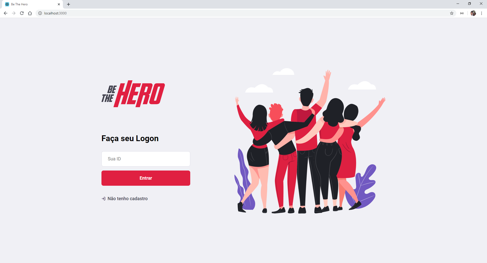
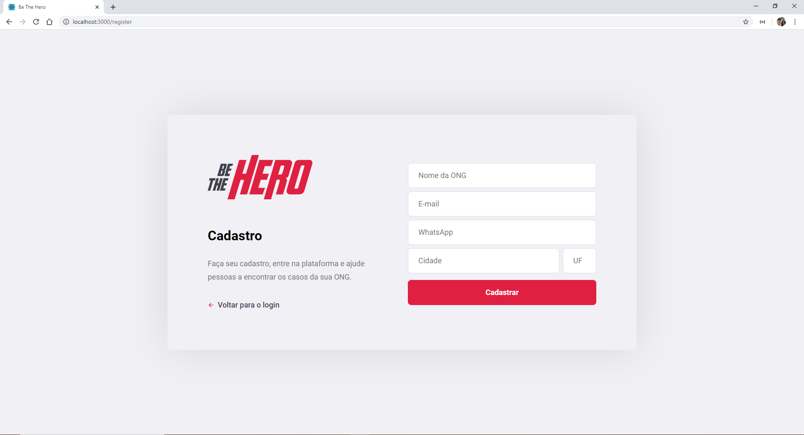
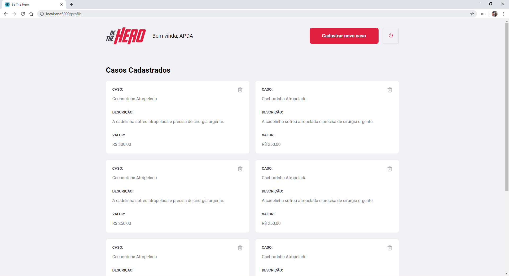
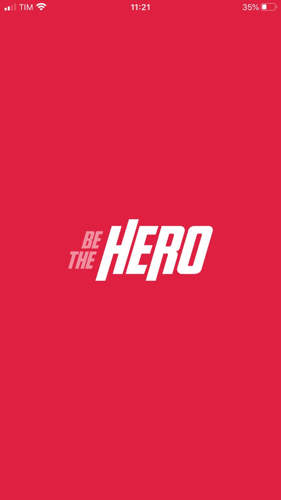
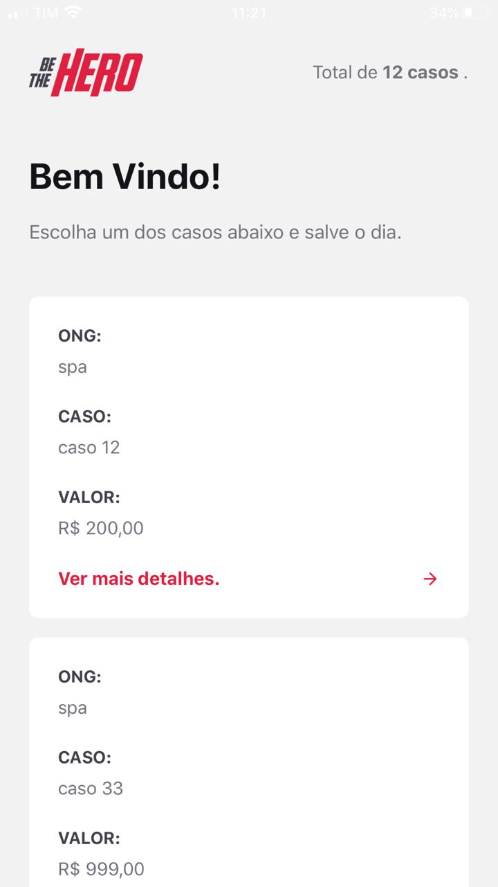
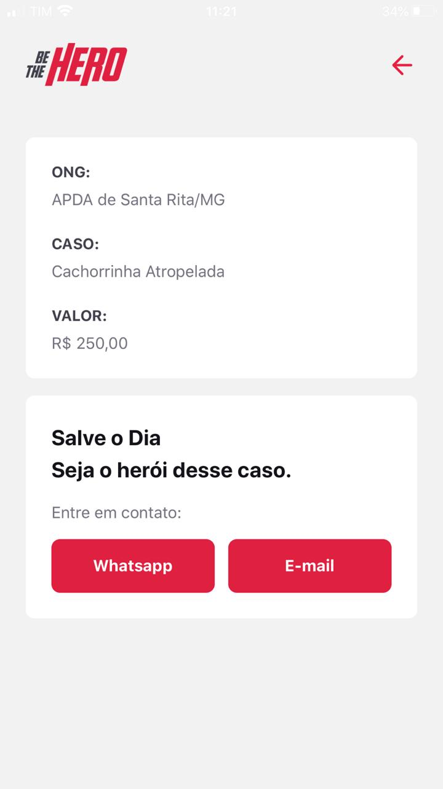
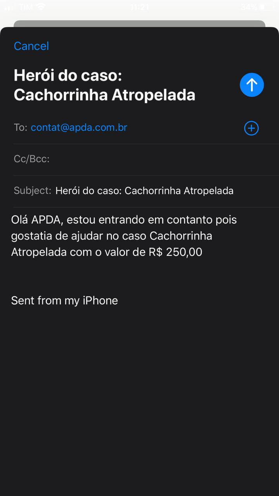

# OmniStack11
## Projeto feito durante a semana Omnistack, orientado pela RocketSeat

## Tecnologias utilizadas: 
  - Node
  - JavaScript
  - React
  - React-Native
  - Css
  - Insomnia
  - Expo

## Sobre

O sistema tem o objetivo de ajudar ONGs a arrecadar dinheiro para casos específicos, os 'heróis' podem ver todos os casos de todas elas e ja contacta-lá diretamente 

## PrintScreens da aplicação Web: 

##  PrintScreens da aplicação Mobile: 

</div
